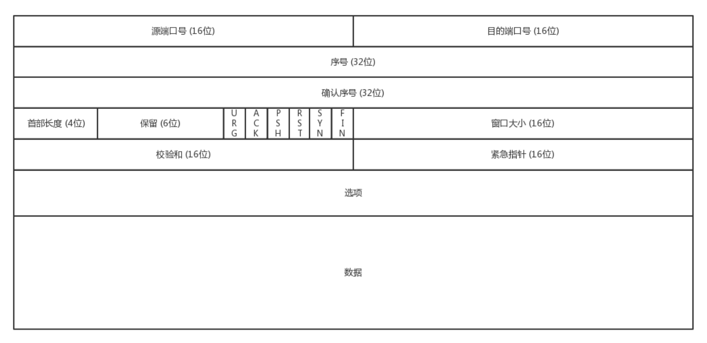
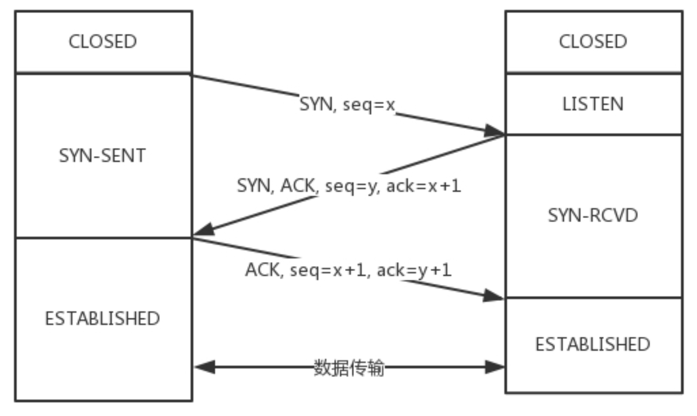
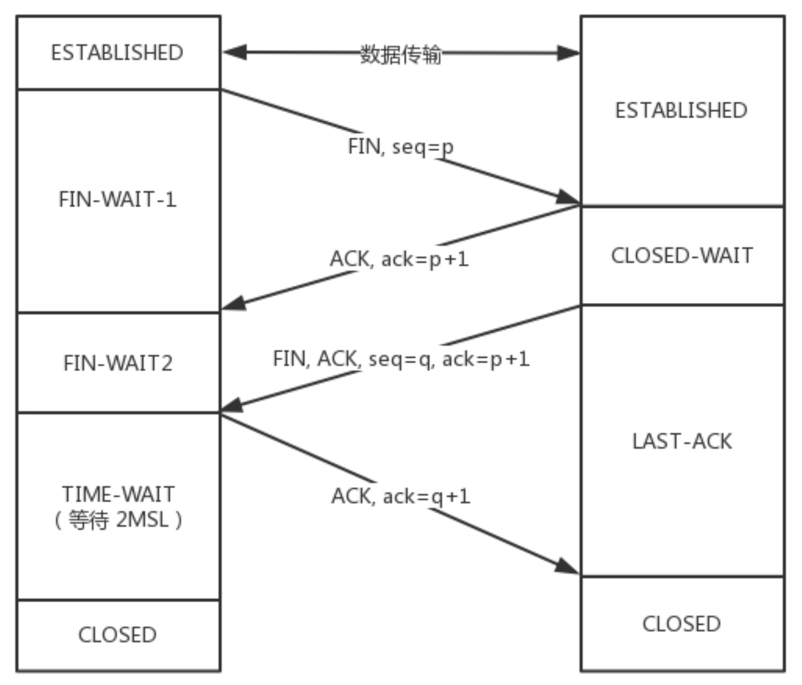
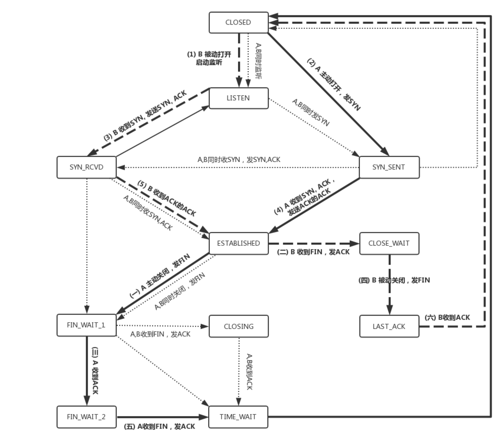

## 传输层协议，tcp与udp的区别
tcp与udp的显著区别是tcp是面向连接的，udp是面向无连接的

何为建立连接？

所谓的建立连接，是为了在客户端和服务端维护连接，而建立一定的数据结构来维护双方交 互的状态，用这样的数据结构来保证所谓的面向连接的特性

* TCP 提供可靠交付。通过 TCP 连接传输的数据，无差错、不丢失、不重复、并且按序到达。我们都知道 IP 包是没有任何可靠性保证的，但是 TCP 可以做到那个连接维护的程序做的事情，而 UDP 继承了 IP 包的特性，不保证不丢失，不保证按顺序到达。
* TCP 是面向字节流的。发送的时候发的是一个流，没头没尾。IP 包可不是一个流，而是一个个的 IP 包。之所以变成了流，这也是 TCP 自己的状态维护做的事情。而 UDP 继承了 IP 的特性，基于数据报的，一个一个地发，一个一个地收。
* TCP 是可以有拥塞控制的。如果发现丢包或者网络情况不佳，会根据情况调整自己的行为，看看是不是发快了，要不要发慢点。UDP 就不会，应用让它发就会发。

TCP 其实是一个有状态服务，通俗地讲就是有脑子的，里面精确地记着发送了没有， 接收到没有，发送到哪个了，应该接收哪个了，错一点儿都不行。而UDP 则是无状态服务。 通俗地说是没脑子的，天真无邪的，发出去就发出去了。

## UDP
### 包头
一个UDP包到达目标机器后，发现 MAC 地址匹配，于是就取下来，将剩下的包传给处理 IP 层的代码。把 IP 头取下来， 发现目标 IP 匹配， 在 IP 头 里面有个 8 位协议，这里会存放，数据里面到底是 TCP 还是 UDP。 接下来的逻辑就可以交给应用了，通过UDP包头的端口号，来识别到底交给哪一个应用程序来处理。UDP包头只包含源端口号、目标端口号、UDP长度、UDP校验和四个部分，都是16位，剩下的就是数据了，包头非常精简(比起TCP)
### 三大特点
* 简单：数据结构、处理逻辑、包头字段简单
* 不建立连接：虽然有端口号，不限制数据的接收方和发送发，甚至可以发广播(多个数据接收方)
* 不会主动调整：无论网络情况如何、是否阻塞、是否丢包，它都照常发
### 主要使用场景
* 需要资源少，在网络情况比较好的内网，或者对于丢包不敏感的应用。
* 不需要一对一沟通，建立连接，而是可以广播的应用
* 需要处理速度快，时延低，可以容忍少数丢包，但是要求即便网络拥塞，还是要照常发送
### 应用举例
#### QUIC
QUIC(全称Quick UDP Internet Connections，快速 UDP 互联网连接)，是谷歌提出的一种基于 UDP 改进的通信协议。 原来访问网页和手机APP主要使用的是基于 TCP 协议的 HTTP 协议，建立连接需要多次交互。 对于移动互联网来说，由于时延较大等原因，建立一次连接需要的时间比较长，而且TCP还可能经常断线重连。 HTTP 协议往往采用多个数据通道共享一个连接的情况，目的是为了加快传输速度，但 TCP 的严格顺序策略会导致阻塞，前一个不来，后一个即便和前一个没关系，也需要等待，加大了时延。 QUIC的目标就是降低网络通信的延迟，它在应用层上实现快速链接建立、减少重传时延，自适应拥塞控制。
#### 流媒体协议
直播协议多使用RTMP，也是一个基于 TCP 的协议。TCP 的严格顺序传输要保证前一个收到了，下一个才能确认，如果前一个收不到，下一个就算包已经收到了，在缓存里面，也需要等着。 这种体验对于直播来说显然是不合适的，对于直播来说，宁可丢包也不要卡顿，用户可以容忍老的视频帧丢失，但不能容忍新的视频帧一直不来。 此外，对于视频来说，连续帧里面有的帧是重要的，有的是不重要的，如果必须丢包，能做到隔几个帧丢一个，用户是感知不到丢包的。 当网络不好的时候，TCP 协议会主动降低发送速度，对于本来就卡的视频是要命的，应用层更希望马上能重传视频而不是主动让步。 基于上述几点，很多直播应用都基于 UDP 实现了自己的视频传输协议。
#### 实时游戏
实时游戏的特点就是实时性高，实时游戏中客户端和服务端会建立长连接来保证实时传输。 由于维护 TCP 连接需要在内核维护一些数据结构，一台机器能够支撑的 TCP 连接数
是有限的，所以 UDP 通常是应对海量客户端连接的策略。 此外，和直播类似的问题，由于 TCP 的强顺序问题，如果出现一个数据包丢失，所有的事情都要停下来等这个数据包重发，然而游戏玩家不关注过期的数据，fps游戏中卡一秒就可能被对手干掉了。 所以，在实时要求比较严格的情况下，游戏厂商也会采取自定义的 UDP 协议，自定义重传策略，把丢包产生的延迟降到最低，尽量减少网络问题对游戏性的影响。
#### 物联网
物联网的终端可能只是个内存很小的嵌入式系统，维护 TCP 协议代价太大，而且物联网对实时性要求也很高，上述原因导致的延时问题在这里也会出现。 Google 旗下的 Nest 建立了 Thread Group，推出了物联网通信协议 Thread ，此协议就是基于 UDP 协议的。
#### 移动互联网
4G 网络的 GTP-U 协议就是基于 UDP 的，因为移动网络协议比较复杂，而 GTP 协议本身就包含复杂的手机上线下线的通信协议。如果基于 TCP， TCP 的机制就显得非常多余。

## TCP
### 包头

* 源端口和目标端口号：与 UDP 一样，必不可少，如果没有这两个端口，数据就不知道要发给哪个应用
* 序号：解决乱序问题
* 确认序号：确认发出去的包已经收到，没有收到会重新发送
* 状态位：例如 SYN 是发起一个连接，ACK 是回复，RST 是重新连接，FIN 是结束连接等。TCP 是面向连接的，因而双方要维护连接的状态，这些带状态位的包的发送，会引起双方的状态变更
* 窗口大小：用来做流量控制，通信双方各声明一个窗口，标识自己当前的处理能力。 除流量控制外， TCP 还会做拥塞控制，在网络环境不佳时降低发送速度。

### 三次握手
即 请求 -> 应答 -> 应答之应答，假设有 A B 两端， A 主动建立连接，A 首先会向 B 发送一个包，在确认 B 收到这个包之前， A 会持续的重发， 当 B 收到后，如果确认可以建立连接，则会发一个应答包给 A (同样在收到应答前会持续重发)， 当 A 收到后，会认为连接已经建立了，并给 B 发送 "应答之应答" 包，B 收到这个消息后才确认连接建立。
* 为什么不是两次？

    两次不足以建立连接，假设 A B 短暂建立了连接又关闭，A 此前为建立连接可能已经发了好几个包，假设其中一个因为各种原因在连接关闭后到达 B ，B 又会建立一个新连接
* 为什么不是四次？

    如果还需确认 "应答之应答"，那么这个过程会无休止的持续下去，四十次、四百次都不够，三次可以保证双方的消息都有去有回就足够了。
    
三次握手除了建立连接外，还沟通了序号的问题。 A 要告诉 B，自己的序号是从什么开始的， B 同样也要告诉 A 。每次连接都要有不同的序号，这主要是为了防止冲突， 比如 A 发了需要为1 2的两个包，在发3的时候，网络突然出问题了，此时如果 A 掉线然后重新和 B 建立连接，包序号又从1开始，发了 1 2两个包，没有发 3，上次连接发送的3此时到达了 B，B会认为这就是下一个包，从而发生错误。 TCP 的包序号，可以看做一个 32 位的计数器，每 4 ms 加 1，可以保证在四个多小时内不重复，不太可能有包在长达四个多小时的网络漫游后才到达目的地。

一开始，客户端和服务端都处于 CLOSED 状态。先是服务端主动监听某个端口，处于 LISTEN 状态。然后客户端主动发起连接 SYN，之后处于 SYN-SENT 状态。服务端收到发起的连接，返回 SYN，并且 ACK 客户端的 SYN，之后处于 SYN-RCVD 状态。客户端收到服务端发送的 SYN 和 ACK 之后，发送 ACK 的 ACK，之后处于 ESTABLISHED 状态，因为它一发一收成功了。服务端收到 ACK 的 ACK 之后，处于 ESTABLISHED 状态，因为它也一发一收了。

### 四次挥手

断开的时候，我们可以看到，当 A 想断开连接，发送 FIN 包，就进入 FIN_WAIT_1 的状态，B 收 到后，发送 ACK 包，就进入 CLOSE_WAIT 的状态。
A 收到 B 的 ACK 包，就进入 FIN_WAIT_2 的状态，如果这个时候 B 直接断开，则 A 将永远在这个状态。TCP 协议里面并没有对这个状态的处理，但是 Linux有，可以调整 tcp_fin_timeout 这个参数，设置一个超时时间。

如果 B 没有直接断开，发送 FIN ACK 请求到 A ，A 回复 ACK 到 B，从 FIN_WAIT_2状态结束，如果这时候 A 直接断开，假如最后的这个 ACK 没有收到，B 会重新发一个给 A，但是再也收不到 A 回复的 ACK了。 所以，TCP 协议要求 A 最后等待一段时间 TIME_WAIT，这个时间要足够长，足够 B 在没有收到 ACK 的情况下再重发到 A， A 再回复 ACK 到达B。 A 直接断开还有一个问题是 A 的端口此时空出来了，但是 B 还不知道， B 之前可能有发送的包还在路上， 此时 A 释放出来的端口可能被新的应用收到，虽然有序号保证但是还是由可能产生混乱(可能过了四个小时，序号已经开始重复了，需要双保险)。 A 等待的时间 TIME-WAIT 通常是 2MSL，MSL是Maximum Segment Lifetime，报文最大生存时间，它是任何报文在网络上存在的最长时间，超过这个时间报文将被丢弃。

 直接断开还有一个问题是，A 的端口就直接空出来了，但是 B 不知道，B 原来发过的很 多包很可能还在路上，如果 A 的端口被一个新的应用占用了，这个新的应用会收到上个连 接中 B 发过来的包，虽然序列号是重新生成的，但是这里要上一个双保险，防止产生混 乱，因而也需要等足够长的时间，等到原来 B 发送的所有的包都死翘翘，再空出端口来。因为 TCP 报文基于是 IP 协议的，而 IP 头中有一个 TTL 域，是 IP 数据报可以经过的最大路由数，每经过一个处 理他的路由器此值就减 1，当此值为 0 则数据报将被丢弃，同时发送 ICMP 报文通知源主机。协议规定 MSL 为 2 分钟，实际应用中常用的是 30 秒，1 分钟和 2 分钟等。
                                                                                                                                   还有一个异常情况就是，B 超过了 2MSL 的时间，依然没有收到它发的 FIN 的 ACK，怎么 办呢?按照 TCP 的原理，B 当然还会重发 FIN，这个时候 A 再收到这个包之后直接发送 RST，B 就知道 A 早就断开了。

  附：TCP状态机
  
  
  ### Advertised window
  TCP 采用的是累计确认(累计应答)模式，每个包会有一个 ID，上文已经说到，在建立连接时，双方会约定 ID 的起始值，然后按照 ID 一个一个发送，为了保证不丢包，需要对每一个收到的包进行应答，但这个应答不是一个一个来的，而是会应答某个 ID 之前的包，表示这个 ID 之前的包都收到了。
  
  为记录所有已经发出的包和收到的包，在发送端中，缓存的数据按照 ID 一个一个排列，分为 已发送已确认、已发送未确认、等待发送(未发送可发送)、暂不发送(未发送不可发送)四个部分， TCP 的流量控制就是基于此来实现的，TCP 会根据接收方给发送方发送的一个窗口值来获悉接收方能处理多少数据，这个窗口就叫做 Advertised window，其实就是 "已发送未确认" 和 "未发送可发送" 这两个部分，数据结构如下
  
  对于接收方来说，缓存的内容分为三个部分：已接收并已确认的、还没接收但是即将可以接收的、还没接收且暂时无法接收的，对应如下数据结构
  
  * MaxRcvBuffer 最大缓存的量;
  * LastByteRead 之后是已经接收了，但是还没被应用层读取的;
  * NextByteExpected 是第一部分和第二部分的分界线。
  对接收方来说，AdvertisedWindow 的值即为 MaxRcvBuffer 减去 NextByteExpected 与 LastByteRead 的差值，NextByteExpected 与 LastByteRead 的差值其实就是还没被应用层读取的部分占用掉的 MaxRcvBuffer 的量

  

